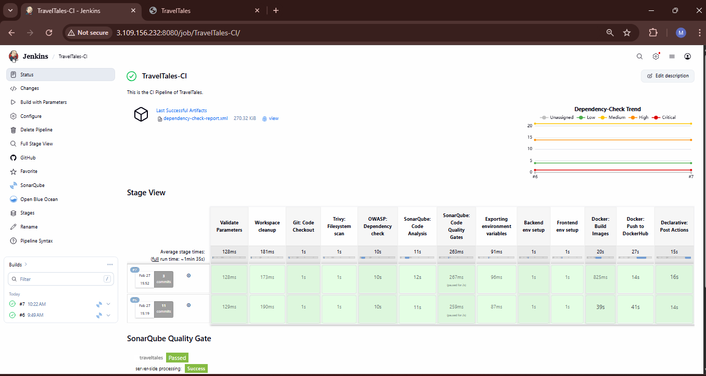
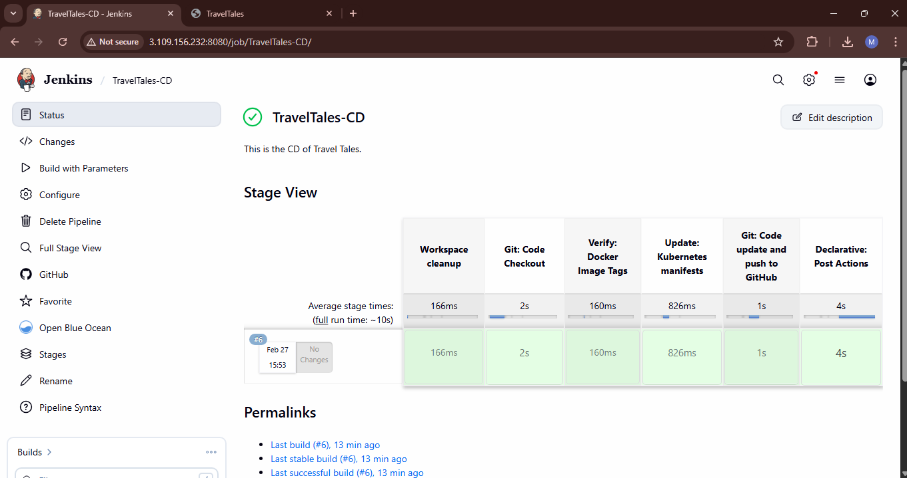

# 🚀 End-To-End DevSecOps Implementation on AWS EKS 

This project shows how I implemented a complete DevSecOps pipeline for a 3-tier MERN application and deployed it on AWS EKS.

I built this project to understand how real-world DevOps works using:

- CI/CD automation

- Security scanning

- GitOps deployment

- Infrastructure as Code

- Monitoring

Everything is automated from code push → build → scan → deploy → monitor.

## Project Deployment Flow


## ⚙️ Tools & Technologies Used
- GitHub – Source Code

- Terraform – Infrastructure creation

- Jenkins – CI/CD automation

- Docker – Containerization

- AWS EKS – Kubernetes cluster

- ArgoCD – GitOps deployment

- SonarQube – Code quality

- OWASP – Dependency check

- Trivy – Image security scan

- Helm – Monitoring setup

- Prometheus – Metrics

- Grafana – Dashboard

## 🔁 CI Pipeline

When code is pushed to GitHub:

- Jenkins pipeline starts automatically

- Runs security checks (OWASP, SonarQube)

- Builds Docker image

- Scans image using Trivy

- Pushes image to DockerHub



## 🚀 CD Pipeline

- Jenkins updates the new image version

- GitOps flow is triggered

- ArgoCD deploys the application to EKS automatically



## 🔄 ArgoCD Deployment

ArgoCD continuously monitors GitHub repo and syncs the application with EKS cluster.


## 🌐 Application Output
Application successfully deployed on AWS EKS.


## 📊 Monitoring Setup
Prometheus & Grafana installed using Helm charts for:

- Cluster health

- Application performance

- Resource usage


## 🛠 Infrastructure Setup using Terraform
Terraform was used to create EC2 infrastructure.
```
terraform init
terraform plan
terraform apply
```


